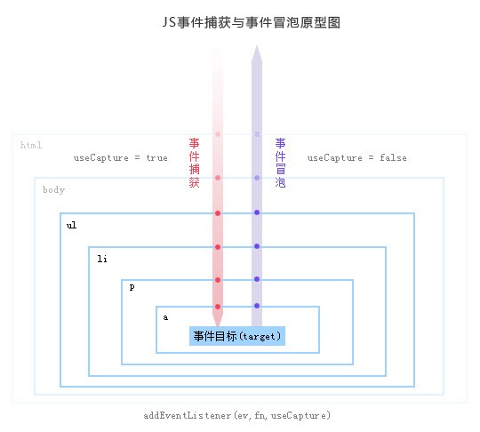

# React事件委托机制

[[TOC]]


## 为什么要用事件委托
一般来说，dom需要有事件处理程序，我们都会直接给它设事件处理程序就好了，那如果是很多的dom需要添加事件处理呢？比如我们有100个li，每个li都有相同的click点击事件，可能我们会用for循环的方法，来遍历，这样的话每个函数都是一个对象，是对象就会占用内存，对象越多，内存占用率就越大，如果数量更大的话就gg了。

## 事件委托的作用
+ 支持为同一个DOM元素注册多个同类型事件
+ 可将事件分成事件捕获和事件冒泡机制
  
## dom 绑定事件
```js
<div class="div1"></div>
//onclick
div1.onclick = function(){
    console.log('打印第一次')
}
div1.onclick = function(){
    console.log('打印第二次')
}
//结果是第二个点击注册事件覆盖了第一个点击事件,只执行了console.log('打印第二次');
```
**DOM 2 实现**
```js
addEventListener(type,listener,useCapture)
div1.addEventListener('click',function(){
   console.log('打印第一次')
})
div1.addEventListener('click',function(){
    console.log('打印第二次')
})
//可以看到两个注册事件都会成功触发
```

## 事件捕获和事件冒泡机制
**事件捕获**
当一个事件触发后,从Window对象触发,不断经过下级节点,直到目标节点。在事件到达目标节点之前的过程就是捕获阶段。所有经过的节点,都会触发对应的事件
**事件冒泡** 
当事件到达目标节点后，会沿着捕获阶段的路线原路返回。同样，所有经过的节点,都会触发对应的事件


上面的`addEventListener`的第三个参数就是设置是捕获还是冒泡阶段，默认是`false是冒泡阶段`，当设为`true的时候是事件捕获`

```js
body.addEventListener('click',function(){
    console.log('打印body')
},true)
div1.addEventListener('click',function(){
    console.log('打印div1')
})
// 打印body   打印div1
```

## addEventListener() 和 onclick的区别
+ onclick 不能同时执行两个函数，addEventListener()可以执行两个不同的函数
+ 移除事件侦听的方式不同 (onclick直接覆盖就行 ，addEventListener用removeEventListener移除)
+ addEventListener可以在捕获阶段和冒泡阶段触发，而onclick只能冒泡阶段触发
+ onclick支持IE低版本，addEventListener不支持IE8一下，低版本的IE使用 attachEvent 进行事件侦听；使用 detachEvent 移除事件侦听。

## 事件委托的优点
**提高性能**每一个函数都会占用内存空间，只需添加一个事件处理程序代理所有事件,所占用的内存空间更少。 动态监听 使用事件委托可以自动绑定动态添加的元素,即新增的节点不需要主动添加也可以一样具有和其他元素一样的事件。

## react的事件委托机制
react事件机制分为两个部分：**1、事件注册 2、事件分发**  
**事件注册**部分，所有的事件都会注册到document上，拥有统一的回调函数dispatchEvent来执行事件分发  
**事件分发**部分，首先生成合成事件，注意同一种事件类型只能生成一个合成事件`Event`，如`onClick`这个类型的事件，dom上所有带有通过jsx绑定的onClick的回调函数都会`按顺序`(冒泡或者捕获）会放到`Event._dispatchListeners`这个数组里，后面依次执行它。
```js
componentDidMount(){
    document.addEventListener('click', function(){
      console.log('document click')
    })
    document.getElementsByClassName('App')[0].addEventListener('click', function(){
      console.log('app click') 
    })
    document.getElementsByTagName('button')[0].addEventListener('click', function(e){
      console.log('button click')  
      // e.stopPropagation();
    })
  } 
  onClick = (e) => {
    e.stopPropagation() // 能够阻止div.app的触发
    e.nativeEvent.stopImmediatePropagation(); // nativeEvent是原生的事件 ， 能够阻止document的触发  
    e.nativeEvent.stopPropagation(); // 什么都阻止不了,因为onClick合成事件都会注册到document上
    console.log('react button click');
  };
  render() {
    return (
      <div className="App" onClick={() => {console.log('react app click')}}>
        <button onClick={this.onClick}>按钮</button>
      </div>
    );
  }
  // button click -> app click -> react button click
```

**实现封步骤**
```js
let vdom = {
  type: 'div',
  props: {
    onClick: function(){ //合成事件
      console.log('react app click')    
    },
    children: [
      {
        type: 'button',
        props: {
           onClick: function() {
              console.log('react button click')    
           }
        }
      }
    ]
  }
}
```

**注册事件**
```js
bankForRegistrationName = { // 回调事件的保存
    // 数字是_debugID,react用于识别每一个dom
    5: {
      click: function(){
        console.log('react app click')    
      },
    },
    6: {
      click: function(){
        console.log('react button click')    
      },
    }
}
```

**事件触发**
```js
// 合成事件简单实现
function SyntheticEvent(e) {
  ...
  this.nativeEvent = e;
  ...
}
// e: event， type: 事件类型
function dispatchEvent(e, type) {
  let synE = new SyntheticEvent(e);
  // 执行监听事件
  let debugID = e.target.__reactInternalInstance$om8tco7dvl._debugID;
  bankForRegistrationName[debugID][type](synE); 
}
// document事件委托
document.addEventListener('click', function(e) {
  dispatchEvent(e, 'click'); // 总之最后是通过点击document做事件委托触发的
})
```


