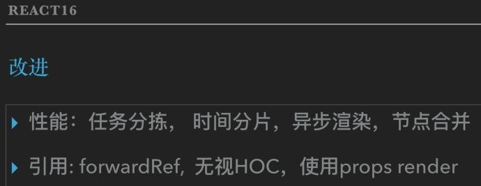
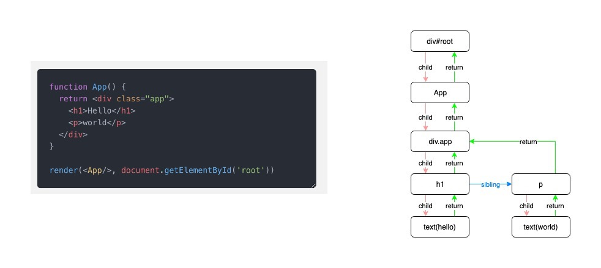
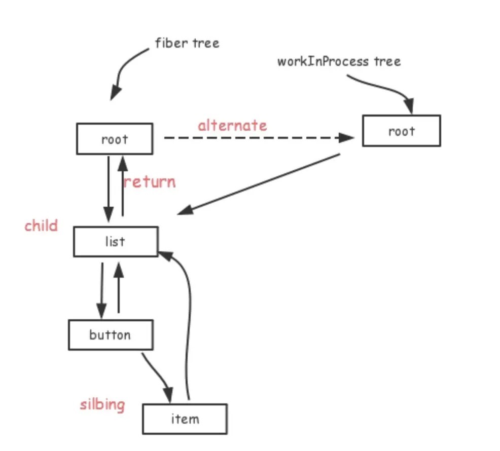
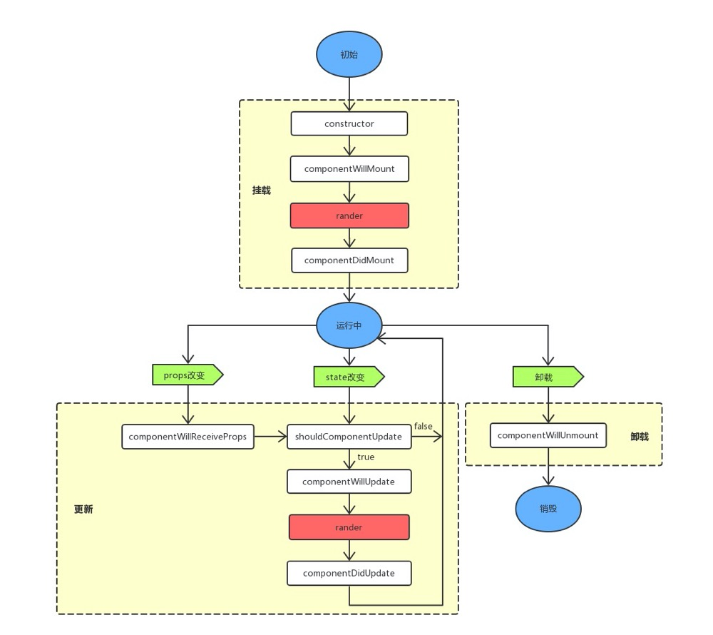
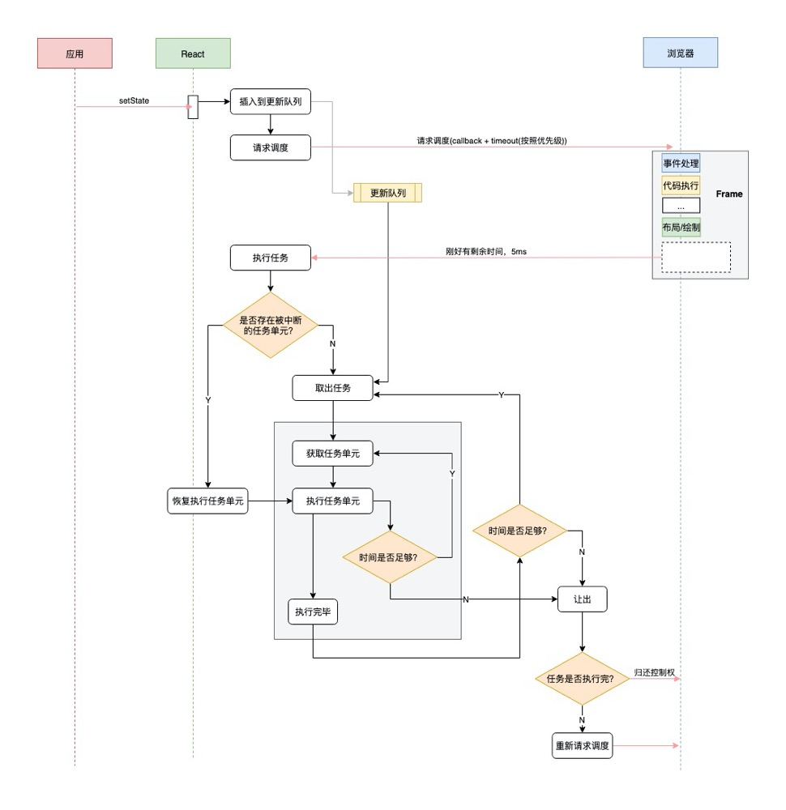

# React16 Fiber

[[TOC]]

React早期的优化都是`停留于JS层面`（vdom的 create/diff），诸如减少组件的复杂度（Stateless）， 减少向下diff的规模(SCU)，减少diff的成本(immutable.js)，当然，也有例外，比如针对老式的IE的LazyDOMTree。 到React16，则`升级到浏览器渲染机制层面`, 在patch上取得了突破。众所周知，浏览器是单线程。 想象一下，如果有两个线程，一个线程要对这节点进行移除，一个要对它进行样式操作。 线程是并发的，无法决定顺序，这样页面的效果是不可控的。换单线程则简单可控， 但JS执行与视图渲染与资原加载与事件回调是如何调度呢，于是有了EventLoop这种东西。

## React16之前的痛点
+ 组件不能返回数组
+ 弹窗问题
+ 异常处理
+ HOC没有考虑到ref与context的向下传递
+ 组件的性能优化全凭人肉，并且主要集中在SCU，希望框架能干些事情，即使不用SCU，性能也能上去。
  

## 解决进度
16版本大更新，Fiber顺手解决了这些痛点  

+ 16.0 让组件支持返回任何数组类型，从而解决数组问题; 推出createPortal API ,解决弹窗问题; 推出componentDidCatch新钩子， 划分出错误组件与边界组件， 每个边界组件能修复下方组件错误一次， 再次出错，转交更上层的边界组件来处理，解决异常处理问题。
+ 16.2 推出Fragment组件，可以看作是数组的一种语法糖。
+ 16.3 推出createRef与forwardRef解决Ref在HOC中的传递问题，推出new Context API，解决HOC的context传递问题
+ 而性能问题，从16.0开始一直由一些内部机制来保证，涉及到批量更新及基于时间分片的限量更新。

  
## Fiber是什么
`eact Fiber`是对核心算法的一次重新实现。`React Fiber`把更新过程碎片化，把一个耗时长的任务分成很多小片，每一个小片的运行时间很短，虽然总时间依然很长，但是在每个小片执行完之后，都给其他任务一个执行的机会，这样唯一的线程就不会被独占，其他任务依然有运行的机会  
+ 在React Fiber中，一次更新过程会`分成多个分片`完成，所以完全有可能一个更新任务还没有完成，就被另一个更高优先级的更新过程打断，这时候，优先级高的更新任务会优先处理完，而低优先级更新任务所做的工作则会完全作废，然后等待机会重头再来
+ 因为一个更新过程可能被打断，所以React Fiber一个更新过程被分为两个阶段(Phase)：第一个阶段`Reconciliation Phase(调度阶段)`和第二阶段`Commit Phase(渲染阶段)`
+ 在`第一阶段Reconciliation Phase`，React Fiber会找出需要更新哪些DOM，这个阶段是`可以被打断`的；但是到了`第二阶段Commit Phase`，那就一鼓-作气把DOM更新完，绝`不会被打断`
+ 这两个阶段大部分工作都是React Fiber做，和我们相关的也就是修改了部分生命周期函数

React Fiber改变了之前react的组件渲染机制，新的架构使原来同步渲染的组件现在可以异步化，可中途中断渲染，执行更高优先级的任务。释放浏览器主线程,解决掉帧的问题

## 关键特性
+ 时间分片（把渲染任务拆分成块，匀到多帧）
+ 更新时能够暂停，终止，复用渲染任务（链表）
+ 给不同类型的更新赋予优先级
+ 并发方面新的基础能力

## 为什么需要异步渲染 
我们都知道在react16之前，react对virtual dom 的渲染是同步的，即每次将所有操作累加起来，统计对比出所有的变化后，统一更新一次DOM树[了解虚拟dom算法](https://github.com/livoras/blog/issues/13)，随着组件层级的深入，由于渲染更新一旦开始就无法停止，导致主线程长时间被占用，这也是react在动画，布局和手势等区域会有造成掉帧、延迟响应（甚至无响应）等不佳体验。

假如更新一个组件需要1毫秒，如果有200个组件要更新，那就需要200毫秒，在这200毫秒的更新过程中，浏览器那个唯一的主线程都在专心运行更新操作，无暇去做任何其他的事情。想象一下，在这200毫秒内，用户往一个input元素中输入点什么，敲击键盘也不会获得响应，因为渲染输入按键结果也是浏览器主线程的工作，但是浏览器主线程被React占着呢，抽不出空，最后的结果就是用户敲了按键看不到反应，等React更新过程结束之后，咔咔咔那些按键一下子出现在input元素里了。

## Fiber的结构
React 目前的做法是使用`链表`, 每个 VirtualDOM 节点内部现在使用 Fiber表示, 它的结构大概如下:
```js
export type Fiber = {
  // Fiber 类型信息
  type: any,
  // ...
  // ⚛️ 链表结构
  // 指向父节点，或者render该节点的组件
  return: Fiber | null,
  // 指向第一个子节点
  child: Fiber | null,
  // 指向下一个兄弟节点
  sibling: Fiber | null,
}
```
Fiber中最为重要的是return、child、sibling指针，连接父子兄弟节点以构成一颗单链表Fiber树，其扁平化的单链表结构的特点`将以往递归遍历改为了循环遍历`，实现深度优先遍历不用每次都进入递归函数，重新生成什么执行上下文，变量对象，激活对象，性能当然比递归好。
 Fiber Reconciliation(更新过程)*

## Fiber tree与workInProgress tree

**current树**:React 在 render 第一次渲染时，会通过 React.createElement 创建一颗 Element 树，可以称之为`Virtual DOM Tree`，由于要记录上下文信息，加入了 Fiber，每一个 Element 会对应一个 `Fiber Node`，将 `Fiber Node` 链接起来的结构成为 `Fiber Tree`。它反映了用于渲染 UI 的应用程序的状态。这棵树通常被称为` current 树`（当前树，记录当前页面的状态）。

在后续的更新过程中（setState），每次重新渲染都会`重新创建 Element`, 但是 Fiber 不会，Fiber 只会使用对应的 Element 中的数据来更新自己必要的属性

Fiber Tree 一个重要的特点是链表结构，将递归遍历编程循环遍历，然后配合 requestIdleCallback API, 实现任务拆分、中断与恢复。

**当 render 的时候有了这么一条单链表，当调用 setState 的时候又是如何 Diff 得到 change 的呢？**

采用的是一种叫双缓冲技术（double buffering），这个时候就需要另外一颗树：WorkInProgress Tree，它反映了要刷新到屏幕的未来状态

**workInProgress树**： 当React经过`current当前`树时，对于每一个先存在的Fiber节点，它都会创建一个替代（alternate）节点，这些节点组成了workInProgress树。这个节点是使用render方法返回的React元素的数据创建的。一旦更新处理完以及所有相关工作完成，React就有一颗替代树来准备刷新屏幕。一旦这颗workInProgress树渲染（render）在屏幕上，它便成了当前树。下次进来会把current状态复制到WIP上，进行交互复用，而不用每次更新的时候都创建一个新的对象，消耗性能

WorkInProgress Tree 构造完毕，得到的就是新的 Fiber Tree，然后喜新厌旧（把 current 指针指向WorkInProgress Tree，丢掉旧的 Fiber Tree）就好了。

这样做的好处：  
+ 能够复用内部对象（Fiber）
+ 节省内存分配、GC的时间开销
+ 就算运行中有错误，也不会影响 View 上的数据

`alternate` 可以理解为一个Fiber版本池，用于交替记录组件更新（切分任务后变成多阶段更新）过程中Fiber的更新，因为在组件更新的各阶段，更新前及更新过程中Fiber状态并不一致，在需要恢复时（如发生冲突），即可使用另一者直接回退至上一版本Fiber。

## Fiber Reconciliation(更新过程) 

react渲染大抵可以分为**reconciler（调度阶段）和 commit（渲染阶段）**，前者用于对比，后者用于操作dom，`reconciler`阶段可以算是一个从顶向下的递归算法，主要工作是对`current tree` 和 `new tree`做计算，找出变化部分。`commit`阶段是对在reconciler阶段获取到的变化部分应用到真实的DOM树中,在绝大部分运用场景中，reconciler阶段的时间远远超过commit，因此Fiber选择将reconciler阶段进行分割。
```js
// 第1阶段 render/reconciliation
//（可中断）render/reconciliation 通过构造workInProgress tree得出change
constructor
componentWillMount //废弃
componentWillReceiveProps //废弃
static getDerivedStateFromProps
shouldComponentUpdate
componentWillUpdate //废弃
render

// 第2阶段 commit
//（不可中断）commit 应用这些DOM change
getSnapshotBeforeUpdate()  //严格来说，这个是在进入 commit 阶段前调用
componentDidMount
componentDidUpdate
componentWillUnmount
```

### diff ~ render/reconciliation
diff的实际工作是对比prevInstance和nextInstance的状态，找出差异及其对应的DOM change。diff本质上是一些计算（遍历、比较），是可拆分的（算一半待会儿接着算）

以Fiber tree为蓝本，把每个Fiber作为一个工作单元，自顶向下逐节点构造workInProgress tree（构建中的新Fiber tree）

具体过程如下（以组件节点为例）：  
1. 如果当前节点不需要更新，直接把子节点clone过来，跳到5；要更新的话打个tag
2. 更新当前节点状态（props, state, context等）
3. 调用shouldComponentUpdate()，false的话，跳到5
4. 调用render()获得新的子节点，并为子节点`创建Fiber`（创建过程会尽量复用现有Fiber，子节点增删也发生在这里）
5. 如果没有产生child Fiber，该工作单元结束，把effect list归并到return，并把当前节点的sibling作为下一个工作单元；否则把child作为下一个工作单元
6. 如果没有剩余可用时间了，等到下一次主线程空闲时才开始下一个工作单元；否则，立即开始做
7. 如果没有下一个工作单元了（回到了workInProgress tree的根节点），第1阶段结束，进入pendingCommit状态
   
实际上是1-6的工作循环，7是出口，工作循环每次只做一件事，做完看要不要喘口气。工作循环结束时，workInProgress tree的根节点身上的effect list就是收集到的所有side effect（因为每做完一个都向上归并）

所以，**构建workInProgress tree的过程就是`diff`的过程**，通过requestIdleCallback来调度执行一组任务，每完成一个任务后回来看看有没有插队的（更紧急的），每完成一组任务，把时间控制权交还给主线程，直到下一次requestIdleCallback回调再继续构建workInProgress tree,这部分的核心是`beginWork`函数。
```js
function beginWork(fiber: Fiber): Fiber | undefined {
  if (fiber.tag === WorkTag.HostComponent) {
    // 宿主节点diff
    diffHostComponent(fiber)
  } else if (fiber.tag === WorkTag.ClassComponent) {
    // 类组件节点diff
    diffClassComponent(fiber)
  } else if (fiber.tag === WorkTag.FunctionComponent) {
    // 函数组件节点diff
    diffFunctionalComponent(fiber)
  } else {
    // ... 其他类型节点，省略
  }
}
```

### patch ~ commit
第2阶段直接一口气做完：
1. 处理effect list（更新DOM树、调用组件生命周期函数以 更新ref、异常处理等内部状态）
2. 出对结束，第2阶段结束，所有更新都commit到DOM树上了  
   
注意，真的是`一口气做完`（同步执行，不能喊停）的，这个阶段的实际工作量是比较大的，所以尽量不要在后3个生命周期函数里干重活儿

patch阶段把本次更新中的所有DOM change应用到DOM树，是一连串的DOM操作。这些DOM操作虽然看起来也可以拆分（按照change list一段一段做），但这样做一方面可能造成DOM实际状态与维护的内部状态不一致，另外还会影响体验。而且，一般场景下，DOM更新的耗时比起diff及生命周期函数耗时不算什么，拆分的意义不很大

## 为什么需要新的生命周期
v16之前的生命周期

1. v16之前的版本，组件在`挂载`过程中会调3次钩子/方法`（constructor, componentWillMount, render）`， 组件在`更新`过程中会调4次钩子 `（componentWillReceiveProps, shouldUpdate, componentWillUpdate,render）`, updateView在check的时候很害怕出错的，总不能每个方法都用try catch包起来，这样会性能很差。而constructor, render是不可避免的，于是对三个willXXX动刀了。
2. 在早期版本中，`componentWillMount与componentWillReceiveProps`会做内部优化，执行多次setState都会延后到render时进行合并处理。因此用户就肆意setState了。这些willXXX还可以让用户任意操作DOM。 操作DOM会可能reflow，这是官方不愿意看到的。于是官方推出了`getDerivedStateFromProps`，让你在render设置新state，你主要返回一个新对象，它就主动帮你setState。由于这是一个静态方法，你不能操作instance，这就`阻止了你多次操作setState`。
3. 生命周期在React v16推出的Fiber之后就不合适了，在render函数之前的所有函数，都有可能被执行多次。 因为新的react引入了异步渲染机制，主要的功能是，在渲染完成前，可以中断任务，中断之后不会继续执行生命周期，而是重头开始执行生命周期。这导致上述的`componentWillMount，componentWillReceiveProps，componentWillUpdate`可能会被中断，导致执行多次，带来意想不到的情况。`如果render前执行的生命周期方法做AJAX请求的话，那AJAX将被无谓地多次调用`
   
`reconciler`阶段的钩子都不应该操作DOM，最好也不要setState，我们称之为`轻量钩子`。`commit`阶段的钩子则对应称之为`重量钩子`

Fiber流程图


## 优先级策略
每个工作单元运行时有6种优先级：

+ synchronous 与之前的Stack reconciler操作一样，同步执行
+ task 在next tick之前执行
+ animation 下一帧之前执行
+ high 在不久的将来立即执行
+ low 稍微延迟（100-200ms）执行也没关系
+ offscreen 下一次render时或scroll时才执行
  
`synchronous`首屏（首次渲染）用，要求尽量快，不管会不会阻塞UI线程。`animation`通过requestAnimationFrame来调度，这样在下一帧就能立即开始动画过程；后3个都是由requestIdleCallback回调执行的；offscreen指的是当前隐藏的、屏幕外的（看不见的）元素


## 参考文档


