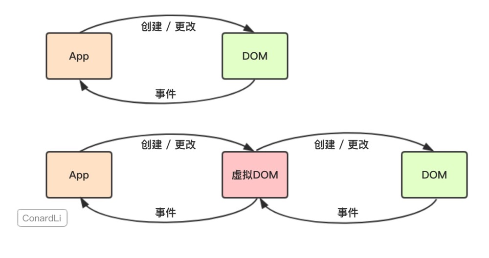
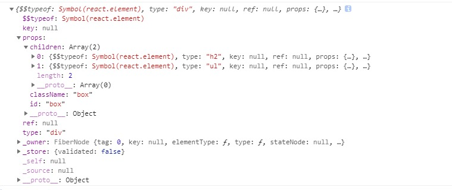
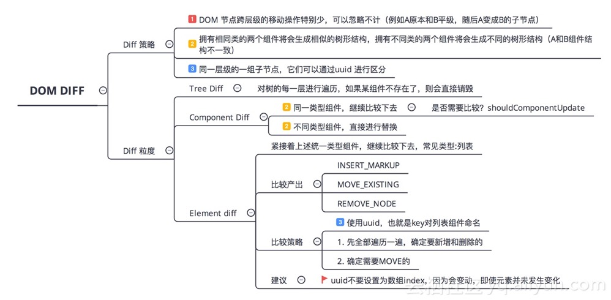
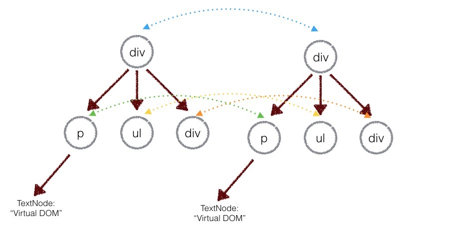
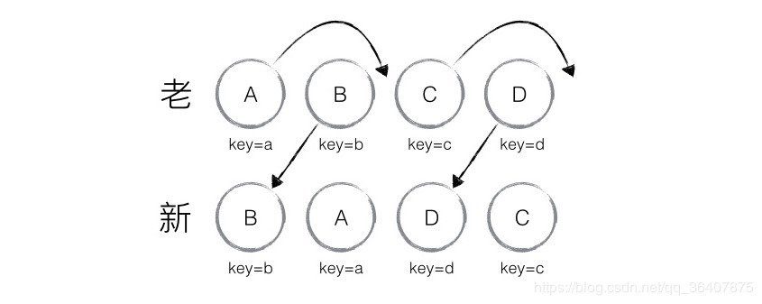
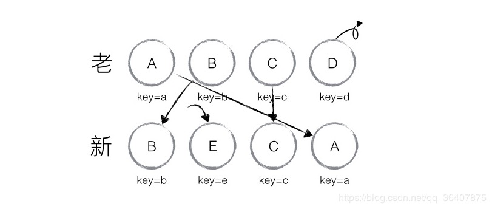
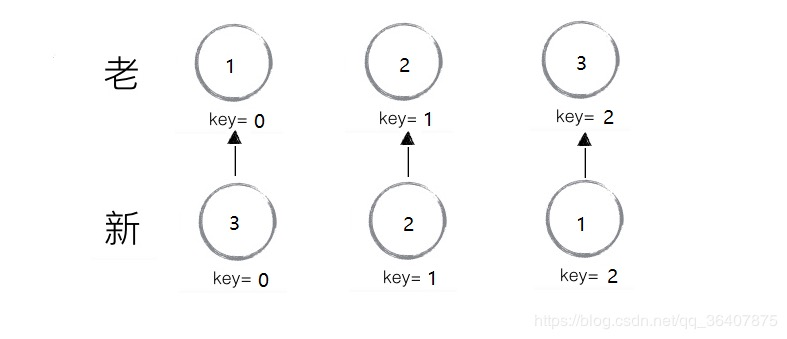

# React-VirtualDOM

[[TOC]]


**React 的核心思想**  
给我一个数据，我根据这个数据生成一个全新的`Virtual DOM`，然后跟我上一次生成的Virtual DOM去 `diff`，得到一个`Patch`， 然后把这个Patch打到浏览器的DOM上去。完事,并且这里的patch显然`不是完整的虚拟DOM`， 而是新的虚拟DOM和上一次的虚拟DOM经过`diff`后的`差异化`的部分。
## JSX和createElement
实现一个React组件时可以选择两种编码方式  
第一种是使用`JSX`编写
```js
class Hello extends Component {
  render() {
    return <div>Hello hzf</div>;
  }
}
```
第二种是直接使用`React.createElement`编写：
```js
class Hello extends Component {
  render() {
    return React.createElement('div', null, `Hello hzf`);
  }
}
```
上面两种写法是等价的，JSX只是为 React.createElement(component, props, ...children)方法提供的语法糖。  
也就是说所有的JSX代码最后都会`转换`成React.createElement(...)，`Babel`帮助我们完成了这个转换的过程。

**注意**：babel在编译时会判断JSX中组件的首字母，当`首字母为小写时`，其被认定为`原生DOM标签`，createElement的第一个变量被编译为字符串；当首`字母为大写`时，其被认定为`自定义组件`，createElement的第一个变量被`编译为对象`,所以组件首字母要大写


## Virtual DOM
  
冷静对待虚拟dom，他不是一定能够提升页面的性能，如果是首次渲染，Vitrua lDom不具有任何优势，甚至它要进行更多的计算，消耗更多的内存，是因为有diff他才会展现它的优势

### Virtual DOM的存在的意义
+ Vitrua Dom为React带来了跨平台渲染的能力。以React Native为例子;React根据Vitrual Dom画出相应平台的ui层，只不过不同平台画的姿势不同而已
+ 服务端渲染
+ 函数式编程

### Virtual DOM 基本步骤:
1. 用`js对象来表示DOM树的结构`； 然后用这个树构建一个真正的DOM树，插入到文档中
2. 当`状态变更`的时候，`重新构造一个新的对象`，然后用这个新的树和旧的树作对比，记录两个树的差异
3. 把2所记录的差异应用在步骤1所构建的真正的DOM树上，视图就更新了
  

+ `type：`元素的类型，可以是原生html类型（字符串），或者自定义组件（函数或class）
+ `key：`组件的唯一标识，用于Diff算法
+ `ref：`用于访问原生dom节点
+ `props：`传入组件的props
+ `owner：`当前正在构建的Component所属的Component
+ `$$typeof：`防止xss攻击，如果你的服务器有一个漏洞，允许用户存储任意JSON对象， 而客户端代码需要一个字符串，这可能为你的应用程序带来风险。JSON中不能存储Symbol类型的变量，而React渲染时会把没有$$typeof标识的组件过滤掉。
+ `self`指定当前位于哪个组件实例。
+ `_source`指定调试代码来自的文件(fileName)和代码行数(lineNumber)。
```js
class React {
    /**
     * 创建虚拟dom用的
     * @param {*} type 标签的类型
     * @param {*} options props
     * @param  {...any} arg 子代
     */
    static createElement(type, options, ...arg) {
        // options肯定是一个对象，不管传还是不传
        options = options || null;
        //arg是存储上下的参数，即使没有其他的参数，arg也是一个空数组，
        let obj = {
            type,
            key: null,
            ref: null,
            props: {}
        };
        //key ref
        ["key", "ref"].forEach(item => {
            if (item in options) {
                obj[item] = options[item];
                delete options[item]
            }
        });
        //处理props
        obj.props = { ...options };
        //因为我这用的es6语法，下面的判断没什么作用，用es5的话需要加上
        let len = arg.length;
        switch (len) {
            case 1:
                obj.props.children = arg[0];
                break;
            default:
                // 拥有多个子节点
                obj.props.children = arg
        }
        return obj;
    }
}

class ReactDom {
    /**
     * 将虚拟节点转换成真实的dom节点，最后插入到container容器中
     * @param {*} objJSX 编译后的虚拟节点
     * @param {*} container 要渲染到那个容器中
     * @param {*} callback 回调函数
     */
    static render(objJSX, container, callback) {
        let newEle = ReactDom.createDomElementFromVnode(objJSX)
        container.appendChild(newEle);
        callback && callback();
    }
    static createDomElementFromVnode(objJSX){
        let { type, props } = objJSX;
        objJSX.newEle = document.createElement(type);
        //设置属性
        for (let key in props) {
            if (!props.hasOwnProperty(key)) continue;
            //className
            if (key === "className") {
                objJSX.newEle.setAttribute("class", props["className"]);
            }
            //style设置
            else if (key === "style") {
                for (let key in props['style']) {
                    if (props["style"].hasOwnProperty(key)) {
                        objJSX.newEle["style"][key] = props["style"][key]
                    }
                }
                continue;
            }
            //children
            else if (key === "children") {
                let children = props['children'];
                if (children instanceof Array) {
                    children.forEach(itemChildren => {
                        ReactDom.handChildren(itemChildren, objJSX.newEle)
                    });
                    continue;
                }
                ReactDom.handChildren(children, objJSX.newEle);
                continue;
            }
            else {
                objJSX.newEle.setAttribute(key, props[key]);
            }
        }
        return objJSX.newEle
    }
    static handChildren(children, newEle) {
        //只有一个子节点
        if (typeof children === "object") {
            //当前唯一的新对象
            ReactDom.render(children, newEle)
        } else {
            newEle.appendChild(document.createTextNode(children))
            console.log(newEle)
        }
    }
}
let styleObj = { color: 'red' };

ReactDom.render(
    React.createElement("div", {
        id: "box",
        className: "box",
        style: styleObj
      }, React.createElement("h2", {
        className: "title"
      }, "\u8FD9\u91CC\u662F\u5934\u90E8"), React.createElement("ul", {
        className: "newsItem"
      }, React.createElement("li", {
        key: "1",
        style: {
          color: "#ccc"
        }
      }, "\u54C8\u54C8\u54C8"), React.createElement("li", {
        key: "2"
      }, "\u5475\u5475\u5475")), "1221"), 
    window.app
);
```

## diff
其实React的 virtual dom的性能好也离不开它本身特殊的diff算法。传统的diff算法时间复杂度达到O(n3)，而react的diff算法时间复杂度只是o(n)，react的diff能减少到o(n)依靠的是react diff的三大策略。

### 传统diff 对比 react diff
传统的diff算法追求的是`“完全”`以及`“最小”`，而react diff则是放弃了这两种追求： 在传统的diff算法下，对比前后两个节点，`如果发现节点改变了，会继续去比较节点的子节点，一层一层去对比`。就这样循环递归去进行对比，复杂度就达到了O(n3)，n是树的节点数，想象一下如果这棵树有1000个节点，我们得执行上十亿次比较，这种量级的对比次数，时间基本要用秒来做计数单位了

### React diff 三大策略
+ tree diff：Web UI中DOM节点跨层级的移动操作特别少，可以忽略不计。`（DOM结构发生改变-----直接卸载并重新creat）`
+ component diff: 组件的DOM结构一样-----不会卸载,但是会update
+ element diff: 所有同一层级的子节点.他们都可以通过key来区分-----同时遵循1.2两点
  

### **虚拟DOM树分层比较（tree diff)**
  
上图中，**div只会和同一层级的div对比，第二层级的只会和第二层级对比。 这样算法复杂度就可以达到O(n)。**

如果DOM节点出现了跨层级操作，diff会如何处理？

React是不会机智的判断出子树仅仅是发生了移动，而是会**直接销毁**，并重新创建这个子树，然后再挂在到目标DOM上;
实际上，React官方也并不推荐我们做出跨层级的骚操作。所以我们可以从中悟出一个道理：就是我们自己在实现组件的时候，一个稳定的DOM结构是有助于我们的性能提升的。

### **组件间的比较（component diff）**
核心的策略还是看结构是否发生改变。React是基于组件构建应用的，对于组件间的比较所采用的策略也是非常简洁和高效的  

**如果是同一个类型的组件**，则按照原策略进行Virtual DOM比较。
**如果不是同一类型的组件**，则将其判断为dirty component，从而替换整个组价下的所有子节点。
**如果是同一个类型的组件，有可能经过一轮Virtual DOM比较下来，并没有发生变化。**如果我们能够提前确切知道这一点，那么就可以省下大量的diff运算时间。因此，React允许用户通过shouldComponentUpdate()来判断该组件是否需要进行diff算法分析。
```js
// 对比自定义组件
function diffComponent(oldNode, newNode) {
  if (oldNode._component && (oldNode._component.constructor !== newNode.nodeName)) { // 如果新老组件不同, 则直接将新组件替换老组件
    const newDom = vdomToDom(newNode)
    oldNode._component.parentNode.insertBefore(newDom, oldNode._component)
    oldNode._component.parentNode.removeChild(oldNode._component)
  } else {
    setProps(oldNode._component, newNode.attributes) // 如果新老组件相同, 则将新组件的 props 赋到老组件上
    renderComponent(oldNode._component)              // 对获得新 props 前后的老组件做 diff 比较（renderComponent 中调用了 diff）
  }
}
```

### 元素间的比较（element diff）
当节点处于同一层级的时候，react diff 提供了三种节点操作：**插入、删除、移动。**
| 操作 | 描述 | 
| -- | -- |
| 插入 | 新节点不存在于老集合当中，即全新的节点，就会执行插入操作 |
| 移动 | 新节点在老集合中存在，并且只做了位置上的更新，就会复用之前的节点，做移动操作（依赖于Key）|
| 删除 | 新节点在老集合中存在，但节点做出了更改不能直接复用，做出删除操作 |

### Key的作用

**react利用key来识别组件，它是一种身份标识标识，就像我们的身份证用来辨识一个人一样**。每个key对应一个组件，相同的key react认为是同一个组件，这样后续相同的key对应组件都不会被创建。

**key的使用场景**
+ 数组动态创建的子组件
+ 为一个有复杂繁琐逻辑的组件添加key后，后续操作可以改变该组件的key属性值，从而达到先销毁之前的组件，再重新创建该组件。

我们在循环渲染列表时候(map)时候忘记标记key值报的警告,既然是警告,就说明即使没有key的情况下也不会影响程序执行的正确性,其实这个key的存在只会影响`diff算法的复杂度`(不是一定会提高性能),也就是说你不加上Key就会暴力渲染，加了Key之后，React就可以做出移动的操作了，看例子
  


每个节点都加上了唯一的key值，通过这个`Key值发现新老集合里面其实全部都是相同的元素`，只不过位置发生了改变。因此就无需进行节点的插入、删除等操作了，只需要将老集合当中节点的位置进行移动就可以了。React给出的diff结果为`：B、D不做操作，A、C进行移动操作`。  
react是如何判断谁该移动，谁该不动的呢？

react会去循环整个新的集合：

①从新集合中取到`B`，然后去旧集合中判断是否存在相同的`B`，确认`B`存在后，再去判断是否要移动： `B`在旧集合中的`index = 1`，有一个游标叫做`lastindex`。默认`lastindex = 0`，然后会把旧集合的`index和游标作`对比来判断是否需要移动，如果**index < lastindex ，那么就做移动操作**，在这里`B的index = 1`，不满足于`index < lastindex`,所以就不做移动操作，然后游标lastindex更新，`取(index, lastindex) 的较大值`，这里就是`lastindex = 1`

② 然后遍历到`A`，`A`在老集合中的`index = 0`，此时的游标`lastindex = 1`，满足`index < lastindex`，所以对A需要移动到对应的位置，此时`lastindex = max(index, lastindex) = 1`

③ 然后遍历到`D`，`D`在老集合中的`index = 3`，此时游标`lastindex = 1`，不满足`index < lastindex`，所以D保持不动。`lastindex = max(index, lastindex) = 3`

④ 然后遍历到`C`，`C`在老集合中的`index = 2`，此时游标`lastindex = 3`，满足`index < lastindex`，所以C移动到对应位置。C之后没有节点了，diff就结束了

以上主要分析新老集合中节点`相同但位置不同`的情景，仅对节点进行位置移动的情况，如果新集合中有新加入的节点且老集合存在需要删除的节点，那么 React diff 又是如何对比运作的呢？

  

在上面的这个例子**A、B、C、D**都没有变化，仅仅是`D`的位置发生了改变。看上面的图我们就知道react并没有把D的位置移动到头部，而是把**A、B、C**分别移动到`D`的后面了，通过前面的两个例子，我们也大概知道，为什么会发生这样的情况了：

因为`D`节点在老集合里面的`index`是最大的，使得**A、B、C**三个节点都会`index < lastindex`，从而导致**A、B、C**都会去做移动操作。所以在开发过程中，尽量减少类似将最后一个节点移动到列表首部的操作，当节点数量过大或更新操作过于频繁时，在一定程度上会影响 React 的渲染性能。

### 三句箴言
所以经过这么一分析`react diff`的三大策略，我们能够在开发中更加进一步的提高react的渲染效率。 

+ 在开发组件时，保持稳定的 DOM 结构会有助于性能的提升；
+ 使用 shouldComponentUpdate()方法节省diff的开销
+ 在开发过程中，尽量减少类似将最后一个节点移动到列表首部的操作，当节点数量过大或更新操作过于频繁时，在一定程度上会影响 React 的渲染性能。

### 为什么不推荐使用index作为Key
```js
import React, { Component } from 'react';
class App extends Component {
   state = {
      list: [{ id: 1, val: 'A' }, { id: 2, val: 'B' }, { id: 3, val: 'C' }]
  }
  click = () => {
    const { list } = this.state
    this.setState({
      list:list.reverse()
    })
  }
  render() {
    return (
      <ul>
        {
          this.state.list.map((item, index) => {
            return (
              <li key={index} >
                {item.val}
                <input type="text"></input>
              </li>
            )
          })
        }
        <button onClick={this.click}>Reverse</button>
      </ul>
    )
  }
}
```
在三个输入框里面，依次输入1，2，3，点击Reverse按钮，按照我们的预期，这时候页面应该渲染成3，2，1，但是实际上，顺序依然还是1，2，3，证明数据确实是更新了的。那么为什么会发生这种事情，我们可以分析一下：
  

出现这种情况，使用key是用来表示唯一的标识组件，当发现setState前后key的值没有发生变化 ，react就会认为你setState前后是同一个组件，进而只会对内部的属性进行修改：

+ 检测key值发现都是0，判定组件为同一个。
+ 检测item.val部分，发现有变化重新渲染这部分
+ 检测input，发现不依赖props，所以不进行重新渲染

### diff 源码
```js
//暂时没有缕清楚
```

## patch
因为步骤一所构建的 JavaScript 对象树和render出来真正的DOM树的信息、结构是一样的。 所以我们可以对那棵DOM树也进行深度优先的遍历，遍历的时候从步骤二生成的patches对象中找出当前遍历的节点差异，然后进行 DOM 操作。

### 差异类型
DOM操作可能会：

+ 替换原来的节点，如把上面的div换成了section。
+ 移动、删除、新增子节点， 例如上面div的子节点，把p和ul顺序互换。
+ 修改了节点的属性。
+ 对于文本节点，文本内容可能会改变。 所以，我们可以定义下面的几种类型：
```js
var REPLACE = 0; 
var REORDER = 1;
var PROPS = 2;
var TEXT = 3;

//patches里面存储着差异的dom,是个数组
patches[0] = [
  {
   type:  TEXT,
   content: 'word'
  },
  { 
    type: PROPS,
    props: {
      id: 'container'
    }
  }
]
```

### patch 源码
```js
//后期再补
```


