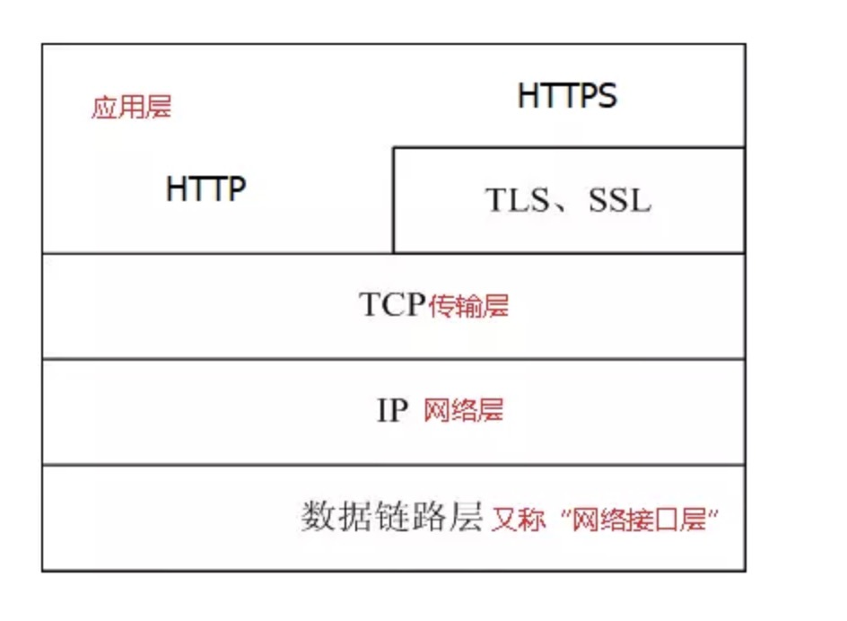
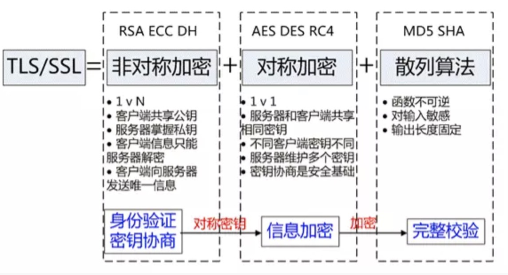

#   Protocol

[[TOC]]


## https

[[TOC]]


```js
HTTP存在的问题
HTTP 本身不具备加密的功能,HTTP 报文使用明文方式发送
由于互联网是由联通世界各个地方的网络设施组成,所有发送和接收经过某些设备的数据都可能被截获或窥视

无法确认你发送到的服务器就是真正的目标服务器(可能服务器是伪装的)

请求或响应在传输途中，遭攻击者拦截并篡改内容的攻击被称为中间人攻击（Man-in-the-Middle attack，MITM）
```

```js
超文本传输安全协议是一种通过计算机网络进行安全通信的传输协议。HTTPS经由HTTP进行通信，
但利用SSL/TLS来加密数据包。HTTPS开发的主要目的，是提供对网站服务器的身份认证
```



```js
SSL和TLS的关系
传输层安全性协议（英语：Transport Layer Security，缩写作 TLS），及其前身安全套接层
（Secure Sockets Layer，缩写作 SSL）是一种安全协议，目的是为互联网通信，提供安全及数据完整性保障。

TLS/SSL 协议
HTTPS 协议的主要功能基本都依赖于 TLS/SSL 协议，TLS/SSL 的功能实现主要依赖于三类基本算法：
散列函数 、对称加密和非对称加密
其利用非对称加密实现身份认证和密钥协商
对称加密算法采用协商的密钥对数据加密
基于散列函数验证信息的完整性


```


##  http和https区别
```js
https就是安全版本的http，譬如一些支付等操作基本都是基于https的，因为http请求的安全系数太低了。

简单来看，https与http的区别就是： 在请求前，会建立ssl链接，确保接下来的通信都是加密的，无法被轻易截取分析
如果要将网站升级成https，需要后端支持（后端需要申请证书等），然后https的开销也比http要大（因为需要额外建立安全链接以及加密等），所以一般来说http2.0配合https的体验更佳（因为http2.0更快了
```

## SSL/TLS的握手流程，如下（简述）
```js
1. 浏览器请求建立SSL链接，并向服务端发送一个随机数–Client random和客户端支持的加密方法，比如RSA加密，此时是明文传输。 
2. 服务端从中选出一组加密算法与Hash算法，回复一个随机数–Server random，并将自己的身份信息以证书的形式发回给浏览器
（证书里包含了网站地址，非对称加密的公钥，以及证书颁发机构等信息）
3. 浏览器收到服务端的证书后
    - 验证证书的合法性（颁发机构是否合法，证书中包含的网址是否和正在访问的一样），如果证书信任，则浏览器会显示一个小锁头，否则会有提示
    - 用户接收证书后（不管信不信任），浏览会生产新的随机数–Premaster secret，然后证书中的公钥以及指定的加密方法加密`Premaster secret`，发送给服务器。
    - 利用Client random、Server random和Premaster secret通过一定的算法生成HTTP链接数据传输的对称加密key-`session key`
    - 使用约定好的HASH算法计算握手消息，并使用生成的`session key`对消息进行加密，最后将之前生成的所有信息发送给服务端。 
4. 服务端收到浏览器的回复
    - 利用已知的加解密方式与自己的私钥进行解密，获取`Premaster secret`
    - 和浏览器相同规则生成`session key`
    - 使用`session key`解密浏览器发来的握手消息，并验证Hash是否与浏览器发来的一致
    - 使用`session key`加密一段握手消息，发送给浏览器
5. 浏览器解密并计算握手消息的HASH，如果与服务端发来的HASH一致，此时握手过程结束
```