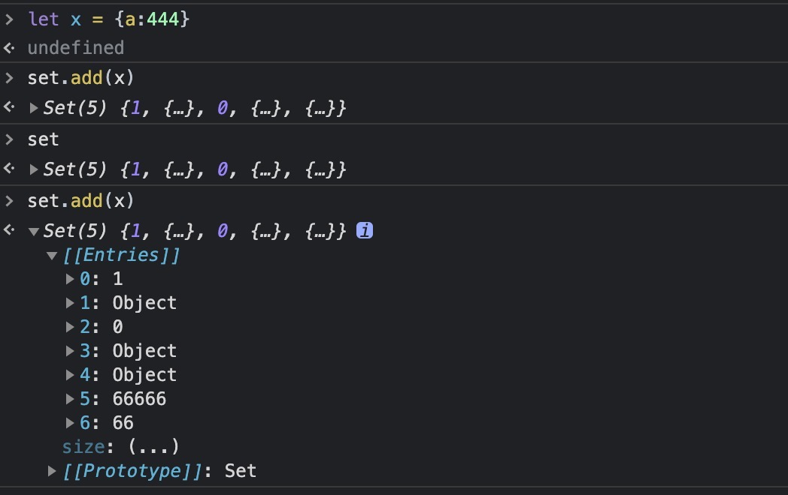
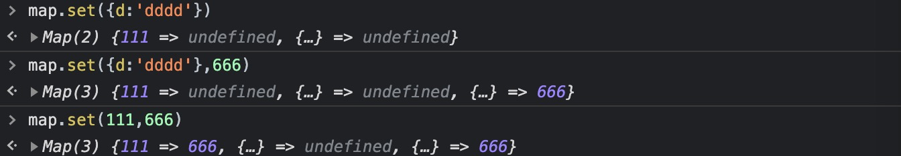

# Array方法 

[[TOC]]

### 快速生成一个数组
```js
//快速生成一个数组
Array.from(Array(100), (key, index) => index);

[...new Array(100).keys()]
```

### some() & every()
`some()是对数组中每一项运行给定函数，如果该函数对任一项返回true，则返回true;some一直在找符合条件的值，一旦找到，则不会继续迭代下去。`
`every()是对数组中每一项运行给定函数，如果该函数对每一项返回true,则返回true;every从迭代开始，一旦有一个不符合条件，则不会继续迭代下去。`

### isArray() 实现
Array.isArray() 用于确定传递的值是否是一个 Array。
```js
// isArray 实现  
Array.myIsArray = function(o) {
  return Object.prototype.toString.call(Object(o)) === '[object Array]';
};
```

### filter实现
```js
Array.prototype.my_filter = function (callback) {
            if (!Array.isArray(this) || !this.length || typeof callback !== 'function') {
                return []
            } else {
                let result = [];
                for (let index = 0; index < this.length; index++) {
                    const element = this[index];
                    if (callback(element, index, this)) {
                        result.push(element)
                    }
                }
                return result
            }
        }

 let arr = [1, 2, 3, 4, 5]
  let res = arr.my_filter((ele, i) => {
      return ele % 2 === 0
  })
  console.log(res)//[2,4]
    
```

### set,map,WeakSet,Weakmap
**set定义及特征**
+ 在js中Set 对象允许存储任何类型的**唯一值**，无论是原始值或者是对象引用。
+ 顶层数据结构不具备key—>value特征,内部会自动加index序列。
+ 可以存储不同类型的任何数据。
+ 如何理解唯一性：对于原始数据类型（boolean，number，string，null，undefined）如果存储相同值则只会保存一个，对于引用类型做“==”判断即引用地址完全相同则只会存一个。
+ `add(value)方法`: 向集合中添加一个元素value。注意：如果向集合中添加一个`已经存在`的元素，不报错但是集合`不会改变`。


**Map 对象保存键值对**  
Map 对象保存键值对。任何值(对象或者原始值) 都可以作为一个键或一个值。  
**与Object的区别：**
+ 一个 Object 的键只能是字符串或者 Symbols，但一个 Map 的键可以是任意值
+ Map 中的键值是有序的（FIFO 原则），而添加到对象中的键则不是
+ Map 的键值对个数可以从 size 属性获取，而 Object 的键值对个数只能手动计算
+ Object 都有自己的原型，原型链上的键名有可能和你自己在对象上的设置的键名产生冲突，而`map健`不可重复，如果键名冲突则会`覆盖`对应的值。


**WeakSet**

```js
//


```

### reduce()
+ reducer 函数接收4个参数:

  +    Accumulator (acc) (累计器,没有返回值为undefined)

  +    CurrentValue (cur) (当前值)

  +    CurrentIndex (idx) (当前索引)

  +    SourceArray (ary) (原数组)
```js
var arr = [3,9,4,3,6,0,9];

//求数组项之和
var sum = arr.reduce(function (prev, cur) {
    return prev + cur;
},0);

//求数组项最大值
var max = arr.reduce(function (prev, cur) {
    return Math.max(prev,cur);
});

Math.max(...arr);

//数组去重
var newArr = arr.reduce(function (prev, cur) {
    prev.indexOf(cur) === -1 && prev.push(cur);
    return prev;
},[]);
```
### slice()
 不会`修改数组`，而是返回一个子数组。如果想删除数组中的一段元素，应该使用方法 Array.splice()。
 + arr.slice(begin ,end?)
   +    （包含 begin，但不包含 end）。
   +    slice(1,4) 会提取原数组中从第二个元素开始一直到第四个元素的所有元素 （索引为 1, 2, 3的元素）。
```js
const animals = ['ant', 'bison', 'camel', 'duck', 'elephant'];
//[].slice.call(animals,1,3)

console.log(animals.slice(2));
// expected output: Array ["camel", "duck", "elephant"]

console.log(animals.slice(2, 4));
// expected output: Array ["camel", "duck"]

console.log(animals.slice(1, 5));
// expected output: Array ["bison", "camel", "duck", "elephant"]
```
### splice()
splice() 方法通过删除或替换现有元素或者原地添加新的元素来修改数组,并以数组形式返回被修改的内容。此方法会改变原数组。

删除


```js

```

### filter() 实现
filter() 方法创建一个新的数组，新数组中的元素是通过检查指定数组中符合条件的所有元素。

注意： filter() 不会对空数组进行检测。

注意： filter() 不会改变原始数组。

example   >>>  array.filter(function(currentValue,index,arr), thisValue)
```js
Array.prototype.selfFilter = function(callback, context) {
  // 不能是null调用方法
  if (this === null) {
    throw new TypeError(
      "Array.prototype.reduce" + "called on null or undefined"
    );
  }
  // 第一个参数必须要为function
  if (typeof callback !== "function") {
    throw new TypeError(callback + " is not a function");
  }
  // 获取数组
  let aArr = Array.prototype.slice.call(this);
  let _len = aArr.length;
  let aFArr = [];
  // 循环调用callback
  for (let i = 0; i < _len; i++) {
    if (!aArr.hasOwnProperty(i)) {
      continue;
    }
    callback.call(context, aArr[i], i, this) && aFArr.push(aArr[i]);
  }
  return aFArr;
};

```
### 数组去重
```js
// 数组去重
function unique(arr, fn) {
  return arr.reduce(fn, []);
}
unique([1,2,3,3,2,1,15,6], function(arr, item) {
  !arr.includes(item) && arr.push(item);
  return arr;
});
```

### forEach中return有效果吗？如何中断forEach循环？
在forEach中用return不会返回，函数会继续执行。
```js
let nums = [1, 2, 3];
nums.forEach((item, index) => {
  return;//无效
})
```
**中断方法：**
- 使用try监视代码块，在需要中断的地方抛出异常。

- 官方推荐方法（替换方法）：用every和some替代forEach函数。every在碰到return false的时候，中止循环。some在碰到return true的时候，中止循环

### 将多维数组转换为一维数组
+ 递归
+ flat
+ 正则
```js
let arr = [1, 2, 3, 4, 5, [6, 7, 8, [9, 10, 11, 12, [13, 14, 15, 16]]]]
console.log(arr.join())   // 输出为：1,2,3,4,5,6,7,8,9,10,11,12,13,14,15,16

let newArr = arr.join().split(',')
let newArr = arr.toString().split(',')
let newArr = (arr + '').split(',')

console.log([1 ,[2, 3]].flat()); // [1, 2, 3]

let ary = [1, [2, [3, [4, 5]]], 6];
let str = JSON.stringify(ary);
let result = str.replace(/(\[|\])/g, '').split(',');
console.log( result )
```

### 数组快速随机排序
```js
let arr =[1,2,3,4];
//方法一
let t;
for(let i = 0;i < arr.length; i++){
  let rand = parseInt(Math.random()*arr.length);
     t = arr[rand];
     arr[rand] =arr[i];
     arr[i] = t;
}
//方法二
arr.sort(()=>{
  return Math.random() - 0.5;
})
```

### 数组排序
```js
function selectSort(arr) {
    var len = arr.length;
    for(let i = 0 ;i < len - 1; i++) {
        for(let j = i ; j<len; j++) {
            if(arr[j] < arr[i]) {
                [arr[i],arr[j]] = [arr[j],arr[i]];
            }
        }
    }
    return arr
}
```

### 判断数组中是否有重复元素
```js
let arr = [1,2,3,4,4]

function isRepeat(arr) {
  let flag = false;
  for(var i = 0; i < arr.length; i++) {
    for(var j = i + 1; j < arr.length; j++) {
      if (arr[i] === arr[j]) {
        flag = true;
        break;
      }
    }
  }
  return flag
}

function isRepeat(arr) {
  let obj = {}
  for(var i = 0; i < arr.length; i++) {
   obj[arr[i]] = arr[i]
  }
  return Object.keys(obj).length !== arr.length
}
```

