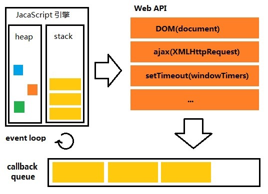

# Event-Loop 

[[TOC]]


## 同步 & 异步 & 多线程
**同步与异步的区别**

同步（Synchronous）：在执行某个操作时，应用程序必须`等待该操作执行完成后`才能继续执行。  
异步（Asynchronous）：在执行某个操作时，应用程序可在异步操作执行时继续执行。实质：异步操作，启动了新的，线程主线程与方法线程并行执行。`异步任务是不会进入主线程，而是会先进入任务队列`

**异步和多线程的区别**

我们已经知道， 异步和多线程并不是一个同等关系,`异步是最终目的,多线程只是我们实现异步的一种手段`。异步是当一个调用请求发送给被调用者,而调用者不用等待其结果的返回而可以做其它的事情。实现异步可以采用多线程技术或则交给另外的进程来处理。

简单的说就是：异步线程是由`线程池`负责管理，而多线程，我们可以自己控制，当然在多线程中我们也可以使用线程池。

[机制详解](http://www.ruanyifeng.com/blog/2014/10/event-loop.html)


## JS中的异步操作
+ 定时函数，如setTimeout setInterval requestAnimationFrame setImmediate(nodeJS）
  - IO 操作（输入/输出），如readFile readdir
  - 网络请求，如ajax http.get（也可以同步，但是等待ajax请求响应之前，页面会卡住，用户什么都做不了,体验差）
  
+ 事件绑定都是异步操作
  - 除了IO设备的事件以外，还包括一些用户产生的事件（比如鼠标点击、页面滚动等等）只要指定过回调函数，这些事件发生时就会进入"任务队列"，等待主线程读取。
+ 回调函数可以理解为异步（不是严谨的异步操作，同步回调，异步回调）
  - 所谓"回调函数"（callback），就是那些会被主线程挂起来的代码。异步任务必须指定回调函数，当主线程开始执行异步任务，就是执行对应的回调函数。

## event-loop（事件轮询）

主线程运行的时候，产生堆（heap）和栈（stack），栈中的代码调用各种外部API， 它们在"任务队列"中加入各种事件（click，load，done）。只要栈中的代码执行完毕，主线程就会去读取"`任务队列（task queue）`"，依次执行那些事件所对应的回调函数

## 宏任务 & 微任务
**`微任务的优先级⽐宏任务的优先级要高`**
+ **浏览器的任务队列:** -主任务队列:存储的都是同步任务
  - 等待任务队列:存储的都是异步任务

+ **微任务:**
  - Promise的then回调函数
  - async函数中await下面的代码
  - process.nextTick（nodeJS）
  - MutationObserver(观察DOM树结构发生变化)

+ **宏任务:**
  - 定时器(setInterval/setTimeout)
  - requestAnimationFrame（专门用于处理动画的API）
  - setImmediate(nodeJS)   

## async/await 和 promise 的执行顺序
### async
**带 async 关键字的函数，它使得你的函数的返回值必定是 promise 对象**
```js
async function fn1(){
    return 123
}

console.log(fn1())
/*
Promise {<resolved>: 123}
*/
```

### await
两种情况
+ 不是promise对象
+ 是promise对象
  
**如果不是 promise（`会被转成一个立即resolve的 Promise 对象`） , await会阻塞后面（并非await后面那个函数）的代码，先执行async函数`外面`的同步代码，同步代码执行完，再回到async内部，据需执行下面的方法**  

**如果它等到的是一个 promise 对象，await 也会`暂停`async后面的代码，先执行async函数外面的同步代码，`等着Promise对象fulfilled`，然后把 resolve 的参数作为 await 表达式的运算结果，然后在继续向下执行剩余的代码**

```js
const ff = async () => {
    console.log('async1 start'); //【1】
    await async2();
    console.log('async1 end')//【2】
    function async2() {
        new Promise((resolve) => {
            console.log(11);//【3】
            resolve(22)
        }).then(
            (data) => {
                console.log(data);//【4】
            }
        )
    }
    console.log('外面')//【5】
};

/*
解析：async函数下的方法，就想成跟普通的函数一样的就行，函数先执行【1】然后执行到await执行的async2，Promise内部相当于同步函数，然后执行【3】，
然后执行async外面的方法，发现没有，然后又回到ff函数内部，执行resolve里面的函数【4】,最后就该轮到【2】和【4】
*/

/*
* async1 start
* 11
* 22
* async1 end
* 外面
*/
```


