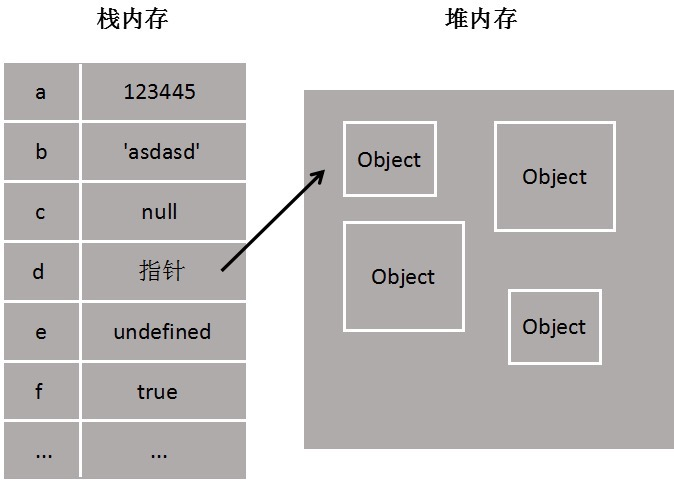

# 堆内存 & 栈内存

[[TOC]]

## 什么是堆和栈
堆和栈其实是两种`数据结构`。堆栈都是一种数据项按序排列的数据结构，只能在一端(称为栈顶(top))对数据项进行插入和删除。堆栈是个特殊的存储区，主要功能是暂时存放数据和地址。

## 堆和栈区别
+ **栈（操作系统）**：由操作系统自动分配释放 ，存放函数的参数值和局部变量的值等。其操作方式类似于数据结构中的栈。简单的理解就是当定义一个变量的时候，计算机会在内存中开辟一块存储空间来存放这个变量的值，这块空间就叫做栈，然而栈中一般存放的是`基本类型数据`，栈的特点是`先进后出（或后进先出）`  
+ **堆（操作系统）**： 一般由程序员分配释放， 若程序员不释放，程序结束时可能由OS回收，分配方式倒是类似于链表。其实在堆中一般存放变量是一些对象类型

## 存取速度
+ `栈`区由于基本数据类型值比较简单，他们都是直接在栈内存中开辟一个位置，把值直接存储进去的，系统分配效率高，存取速度快
+ `堆`内存首先要在运行时动态分配内存，之后又要把指针存储到栈内存中，效率相对就要低一些了。

## 栈与队列的区别
1. `队列`先进先出，`栈`先进后出。
2. 对插入和删除操作的"限定"不同。  
    + `栈`是限定只能在表的一端进行插入和删除操作的线性表
    + `队列`是限定只能在表的一端进行插入和在另一端进行删除操作的线性表
3. 遍历数据速度不同。
    + `栈`只能从头部取数据，也就最先放入的需要遍历整个栈最后才能取出来，而且在遍历数据的时候还得为数据开辟临时空间，保持数据在遍历前的一致性。
    + `队列`则不同，它基于地址指针进行遍历，而且可以从头或尾部开始遍历，但不能同时遍历，无需开辟临时空间，因为在遍历的过程中不影像数据结构，速度要快的多

