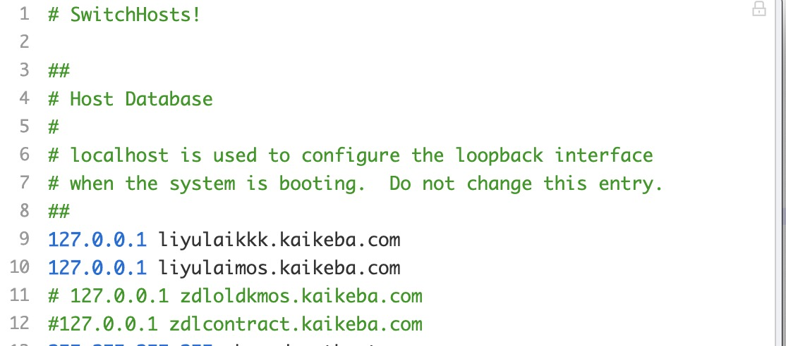
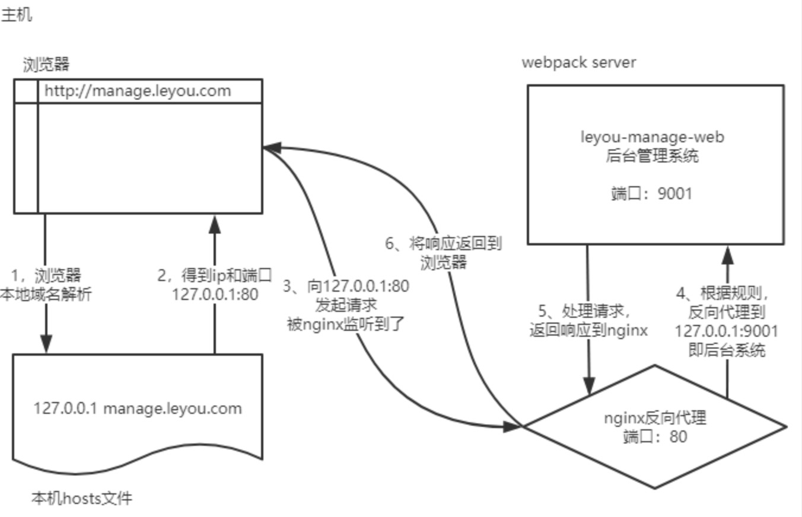

# 跨域&nginx本地项目代理 

[[TOC]]

## 什么是跨域
跨域是指浏览器允许向服务器发送跨域请求，从而克服`Ajax`只能`同源`使用的限制

### 什么是同源策略？
`「protocol（协议）、domain（域名）、port（端口）三者一致。」`

「同源策略」是一个重要的`安全策略`，它用于限制一个origin的文档或者它加载的脚本如何能与另一个源的资源进行交互。它能帮助阻隔恶意文档，减少可能被攻击的媒介。 

## 如何解决跨域？

### CORS
跨域资源共享[(CORS)](https://developer.mozilla.org/zh-CN/docs/Glossary/CORS) 是一种机制，它使用额外的[HTTP](https://developer.mozilla.org/zh-CN/docs/Glossary/HTTP)头来告诉浏览器 让运行在一个 origin (domain) 上的 Web 应用被准许访问来自不同源服务器上的指定的资源。当一个资源从与该资源本身所在的服务器**不同的域、协议或端口**请求一个资源时，资源会发起一个**跨域 HTTP 请求**。

在 cors 中会有`简单请求`和`复杂请求`的概念

使用 IE<=9, Opera<12, or Firefox<3.5 或者更加老的浏览器，这个时候请使用 JSONP 


## 本地项目通过nginx代理
本地启动nginx并修改host文件

### host文件修改指向
比如我这里新增设置了一个` 127.0.0.1 liyulaikkk.kaikeba.com `的域名：  
**`伪造本地的hosts文件，实现对域名的解析`**

[host文件解释](https://zhuanlan.zhihu.com/p/126118758)

### nginx解决端口问题
`server_name`访问的地址与host一致 ，`proxy_pass`本地项目启动地址+端口
```js
http {
//     省略配置
    server {
        listen 80;
        server_name liyulaimos.kaikeba.com;
        location / {
        proxy_pass http://127.0.0.1:3006;
        }
    }
    server {
        listen 80;
        server_name liyulaikkk.kaikeba.com;
        location / {
        proxy_pass http://127.0.0.1:3000;
        }
    }
}

```

### 流程解析
1. 浏览器准备发起请求，访问http://mamage.leyou.com，但需要进行域名解析
2. 优先进行本地域名解析，因为我们修改了hosts，所以解析成功，得到地址：127.0.0.1（本机）
3. 请求被发往解析得到的ip，并且默认使用80端口：http://127.0.0.1:80 ，本机的nginx一直监听80端口，因此捕获这个请求
4. nginx中配置了反向代理规则，将manage.leyou.com代理到http://127.0.0.1:9001
5. 主机上的后台系统的webpack server监听的端口是9001，得到请求并处理，完成后将响应返回到nginx
6. 主机上的后台系统的webpack server监听的端口是9001，得到请求并处理，完成后将响应返回到nginx  
**流程图**


### 参考文章
[参考文章](https://blog.csdn.net/weixin_42148087/article/details/107488823)


