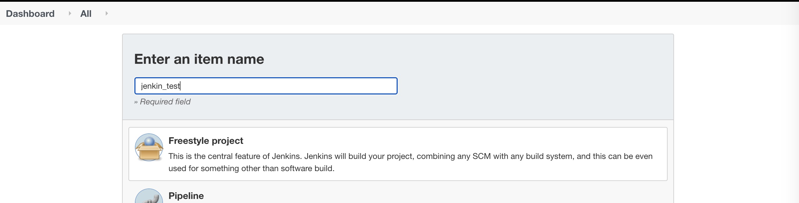
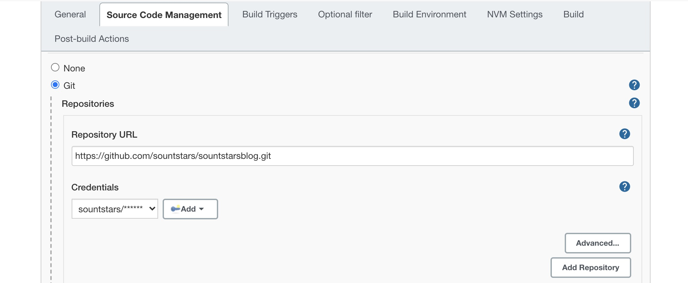
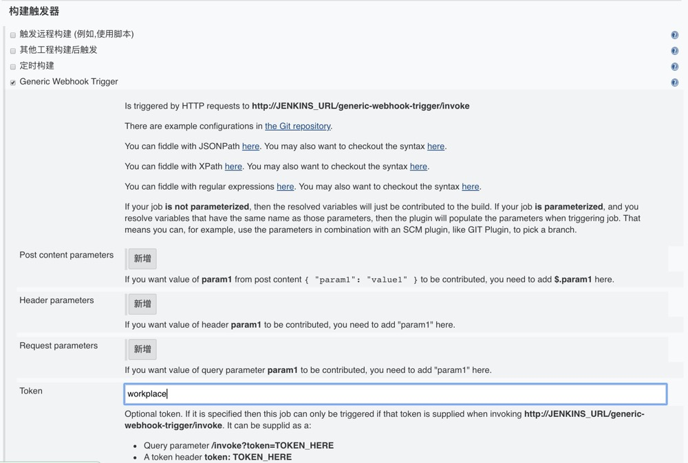
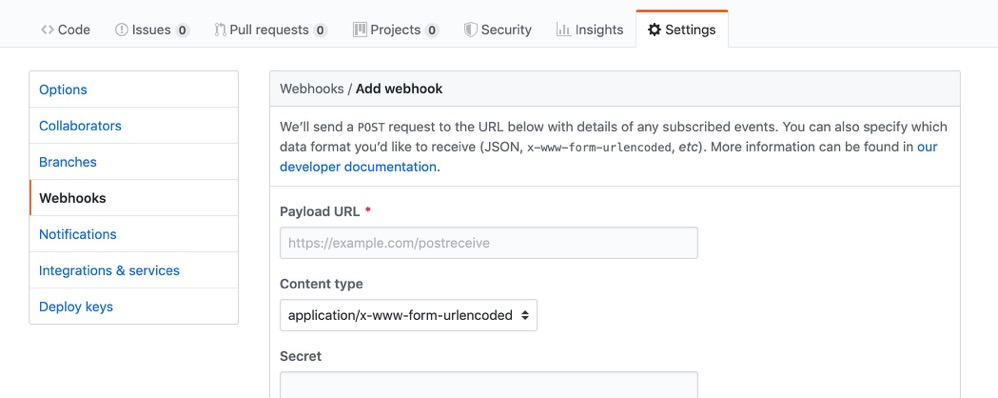
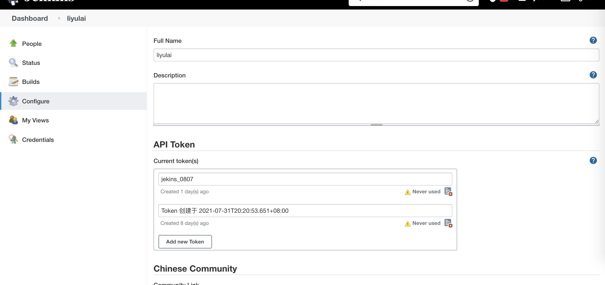
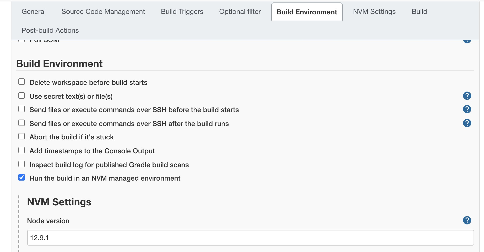
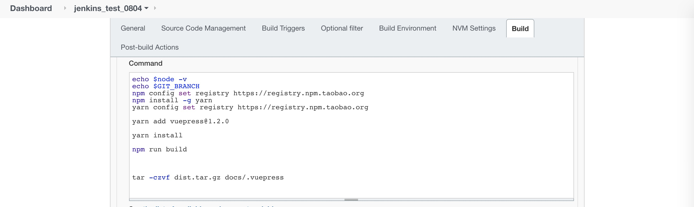
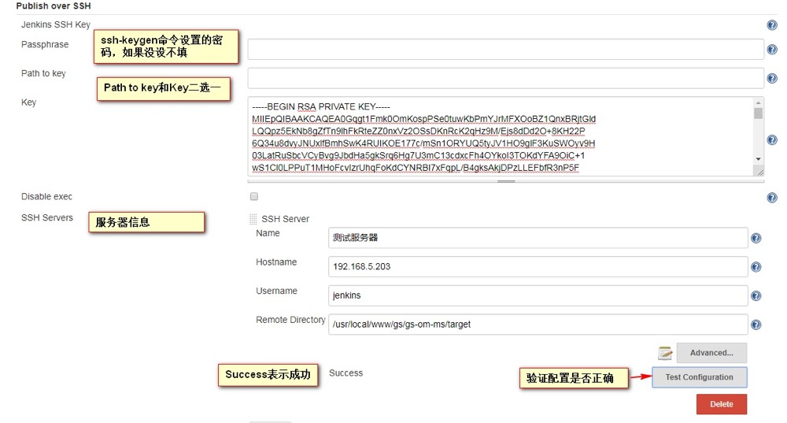
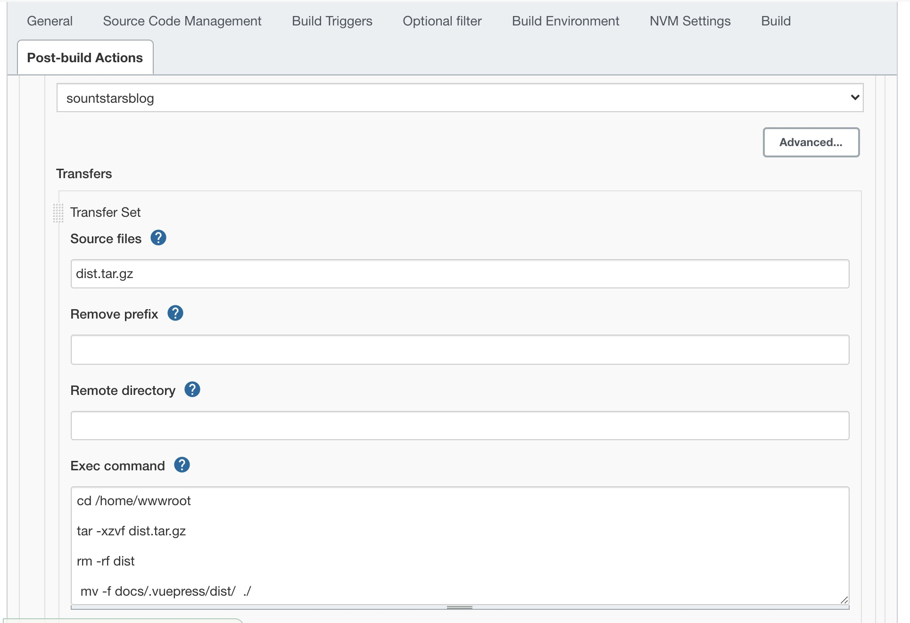

# Jenkins自动化部署
 

 ### 安装插件
 系统管理->插件管理->高级->升级的站点
```js
Generic Webhook Trigger  //web触发器

Publish Over SSH  //通过ssh部署服务器

nvm wrapper   //提供node环境 

//这个我没装
Role-based Authorization Strategy//增加用户的权限管理

```

### 添加项目
新建一个任务[name]->构架一个自由风格的项目->确定


+ 源代码->git->https://github.com/sountstars/sountstarsblog.git
+ 添加权限【git 的用户名和密码
+ 构建触发器(Generic Webhook Trigger)
+ 应用保存
  



### 配置webhook
此时可以构建了，但是需要在还给Git中添加Webhooks，否则不能自动化构建


`http://JENKINS_URL/generic-webhook-trigger/invoke`

JENKINS_URL格式为 用户名:`http://admin:token@服务器ip:8081/generic-webhook-trigger/invoke`

**token生成位置**


### 构建
-> 下拉任务名字->配置->构建环境（选中Run the build in an NVM managed environment，【我们自己下载的插件提供node环境】）
-> 输入node的版本号->构建->选择shell


**构建时候执行命令**

`这里不能执行mv命令`


```js
cd /home/wwwroot
tar -xzvf dist.tar.gz 
rm -rf dist
mv -f docs/.vuepress/dist/  ./
```

### Post-build Actions 的SSH Sercer Name 添加(添加服务器的私钥)
系统管理->系统设置->Publish over SSH
`username 生成密钥的账户`


**配置免费登录（同一台也要）**
`这里不配置免登录，在部署的时候，找不到要部署的服务器`
ssh-keygen -t rsa
ssh-copy-id `IP`

### 构建后操作
下拉任务名字->配置->构建后操作->Send build artifacts over SSH



  

